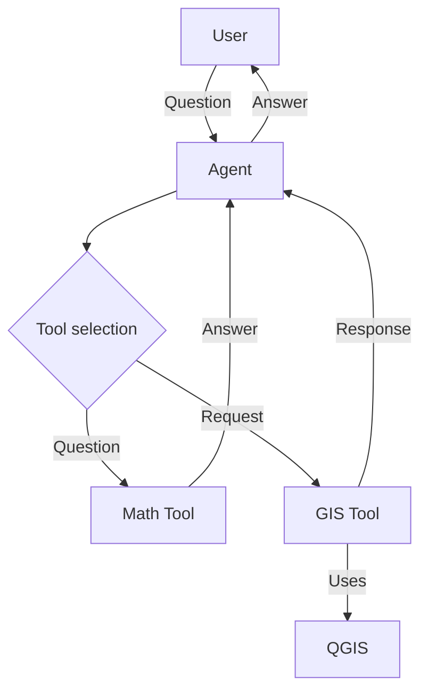

# AskGIS
<!--

-->

This is a **proof-of-concept** of integrating GPT-3 via LangChain into QGIS, giving it access to interact with the data in the current project.

https://user-images.githubusercontent.com/3686998/235088099-60aa9c06-7198-45d0-9f1b-e6c1524d0c92.mp4

## Installation

There is currently no packaged plugin available, refeer to [Development](#Development) if you are interested in testing this plugin.

Note: You must install [LangChain](https://pypi.org/project/langchain/) and [OpenAI](https://pypi.org/project/openai/) manually using PIP.

## Architecture

This plugin uses the Agent infrastructure of LangChain in order to be able to "branch out" to various tools, for example to be able to calculate mathematical questions or, in this case more interestingly, query and interact with the QGIS project.

When working with the QGIS project this plugin generates a prompt consisting of Python code and asks the LLM (GPT-3) to complete a function that will give it the answer it needs to perform the action the user wants. This Python code is than executed (for this reason
you probably shouldn't use this for anything important) to produce a sort of AST (Abstract Syntax Tree), which is then executed to produce the result. Finally, this result is passed back to the agent which uses it to formulate a final response for the user.

## Development

Refer to [development](docs/development.md) for developing this QGIS3 plugin.

## Future Ideas

* Being able to ask for things close to something else (usually a POI); "Select schools within 500m of the train station"
* Indexing layers containing text (likely using QGIS expressions to produce the content to be indexed) and being able to query that index

## License
This plugin is licenced with[GNU General Public License, version 3](https://www.gnu.org/licenses/gpl-3.0.html)

See [LICENSE](LICENSE) for more information.
